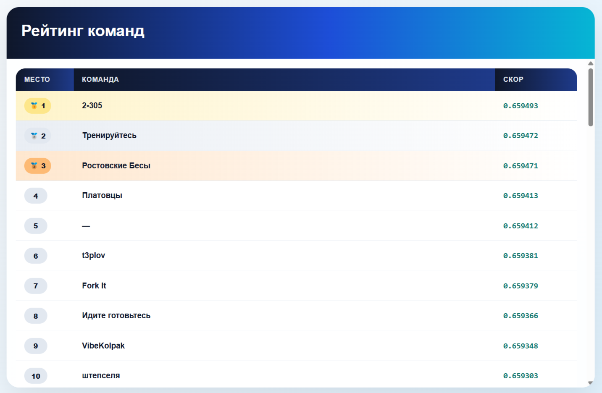

# Третий Кейс-чемпионат от Центр-Инвест
Задача соревнований: разработать модель мультилейбл-классификации, которая для каждого клиента оценит вероятность интереса к каждому из 10 финансовых продуктов 
(от кредитных карт и ипотеки до премиум-счетов). Поскольку один клиент может одновременно проявлять интерес к нескольким услугам, 
модель должна корректно работать с пересекающимися целевыми метками и выдавать хорошо откалиброванные вероятности.

Метрика соревнования ROC_AUC

## Данные 
- `user_id` — уникальный идентификатор клиента;
- `age` — возраст клиента;
- `income_bucket` — категория дохода (ординальное кодирование);
- `tenure_months` — срок обслуживания в банке (месяцы);
- `tx_count_30d` — количество транзакций за последние 30 дней;
- `avg_tx_amount` — средний чек транзакции;
- `digital_activity_score` — оценка цифровой активности (0–1);
- `has_child` — есть ли дети (True/False);
- `is_salary_client` — является ли клиент зарплатным (True/False).

Целевые переменные (9 продуктов):
product_credit_card — кредитная карта;
product_mortgage — ипотека;
product_deposit — вклад;
product_investment — инвестиционный продукт;
product_insurance — страхование;
product_p2p_transfer — P2P-переводы;
product_cashback — кэшбэк-программа;
product_premium_account — премиум-счёт;
product_business_loan — бизнес-кредит;

Каждая целевая переменная — бинарная: 1 означает интерес клиента к продукту, 0 — отсутствие интереса. Один клиент может иметь несколько единиц одновременно.

## Мои результаты
**Результат:** 6 место из 57 команд
<p align="center">
  <br>
  <em>Финальный рейтинг команд</em>
</p>
Это был мой первый опыт участия в таких мероприятиях. Я проверил свои силы на реальной задаче, перебрал несколько моделей классификации, 
такие как LogisticRegression, LightGBM, CatBoost. Использовал разные признаки для обучения, по разному их обрабатывал. 
Этот кейс-чемпионат дал понимание моих сильных и слабых сторон. Я считаю у меня вышел очень хороший результат, учитывая что я участвовал в одиночку.

## Структура проекта
- `train.py` — предобработка данных (удаление выбросов, фильтрация неоднородных записей) и обучение модели.
- `run.py` — скрипт для загрузки модели и генерации предсказаний на новых данных.
- `baseline_model.joblib` — обученая модель.
- `requirements.txt` — зависимости.

## Как запустить
```bash
   git clone https://github.com/t3plov/hackaton_centr_invest.git
   cd Baseline
